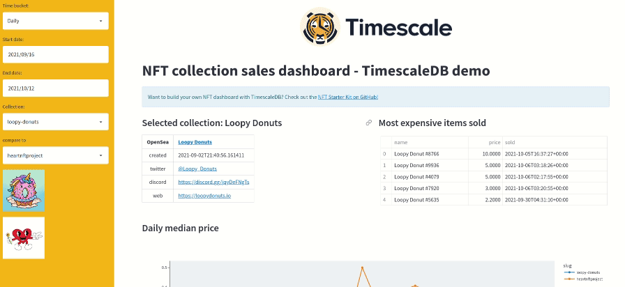

# Streamlit NFT sales dashboard



## Prerequisites
* Python 3
* [TimescaleDB installed][install-ts]
* Schema has been set up using the [`schema.sql`][schema] script.

## Install requirements

We recommend to create a separate virtual environment for this project and
install the requirements there:

```bash
virtualenv env && source env/bin/activate
pip install -r requirements.txt
```

## Ingest sample data
1.  Download [sample NFT data][sample-dw]:
    ```bash
    wget https://assets.timescale.com/docs/downloads/nft_sample.zip
    ```
1. Unzip the file
    ```bash
    unzip nft_sample.zip
    ```
1.  Insert the content of the CSV files into the database using psql:
    ```bash
    psql -x "postgres://tsdbadmin:{YOUR_PASSWORD_HERE}@{YOUR_HOSTNAME_HERE}:{YOUR_PORT_HERE}/tsdb?sslmode=require"
    ```
    If you're using Timescale Cloud, the instructions under `How to Connect` provide a 
    customized command to run to connect directly to your database.

    ```bash
    \copy accounts FROM 001_accounts.csv CSV HEADER;
    \copy collections FROM 002_collections.csv CSV HEADER;
    \copy assets FROM 003_assets.csv CSV HEADER;
    \copy nft_sales FROM 004_nft_sales.csv CSV HEADER;
    ```

## Modify database secrets
1. Open the `.streamlit/secrets.toml` file
1. Modify the secrets so Streamlit can connect to your database
    ```text
    [NFT_DATABASE]
    dbname="tsdb"    
    host="xxxxxxxxxxxxxx.tsdb.cloud.timescale.com"
    user="tsdbadmin"
    password="xxxxxxx"
    port=33333    
    ```

## Run the app
```bash
streamlit run app.py
```


[install-ts]: https://docs.timescale.com/timescaledb/latest/how-to-guides/install-timescaledb/#install-timescaledb
[sample-dw]: https://assets.timescale.com/docs/downloads/nft_sample.zip
